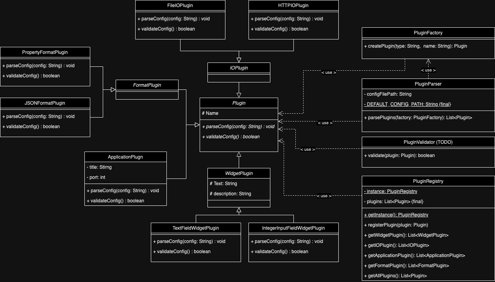

# Configuration Handler


## Overview

The Configuration Handler is a flexible and extensible architecture designed to manage plugins in our application. It provides a streamlined way to add and manage various types of plugins, including Widgets, IO, and Format plugins.

### Class Diagram



### Architectural Structure

The architectural structure of the Configuration Handler is organized into the following packages:

```
ch.hftm.core.confighandler
├── ConfigKeysConstants.java
├── Plugin.java
├── PluginFactory.java
├── PluginParser.java
├── PluginRegistry.java
├── PluginType.java
├── application
│   └── ApplicationPlugin.java
├── format
│   ├── FormatPlugin.java
│   └── PropertyFormatPlugin.java
├── io
│   ├── FileIOPlugin.java
│   └── IOPlugin.java
└── widget
├── TextFieldWidgetPlugin.java
└── WidgetPlugin.java
```

### Package Descriptions

* ConfigKeysConstants: Contains constants for configuration keys used in the TOML files.
* Plugin: Represents a generic plugin interface.
* PluginFactory: Implements the Factory Pattern for creating plugin instances.
* PluginParser: Acts as a Facade for parsing and initializing plugins.
* PluginRegistry: Implements the Singleton Pattern to manage and provide global access to all plugins.
* PluginType: Enumerates different plugin types (e.g., Widget, IO, Format).
* application: Contains the ApplicationPlugin, which retrieves application-specific configurations.
* format: Contains classes related to format plugins.
* io: Contains classes related to IO plugins.
* widget: Contains classes related to widget plugins.

### Design Patterns Used

The following design patterns have been implemented in the Configuration Handler:

1.	Factory Pattern – For creating plugin instances in PluginFactory.
2.	Singleton Pattern – For PluginRegistry to manage and provide global access to plugins.
3.	Facade Pattern – With PluginParser to simplify plugin parsing and initialization.
4.	Strategy Pattern – Through specialized classes for different plugin types, enabling flexible plugin behavior.

### Retrieving Plugins from PluginRegistry

Other teams can easily retrieve the list of plugins from the PluginRegistry by following these steps:

1.	Get the Instance of PluginRegistry: Use the `getInstance()` method to retrieve the singleton instance of PluginRegistry.

``` java
PluginRegistry registry = PluginRegistry.getInstance(); 
```

2.	Retrieve All Plugins: Call `getAllPlugins()` to get the list of all registered plugins.

``` java
List<Plugin> plugins = registry.getAllPlugins();
```

3.	Filter Plugins by Type: If you need plugins of a specific type (e.g., widgets, IO, or formats), you can use the `getPluginsByType(PluginType type)` method.

``` java
List<Plugin> widgetPlugins = registry.getPluginsByType(PluginType.WIDGET);
```

This allows teams to efficiently access the plugins they need without having to manage the underlying details of the configuration handling.

## Validation Rules

The following validation rules are implemented to ensure the integrity and correctness of plugin configurations. Each plugin type has specific requirements that must be met during the validation process.

### Application Plugin Validation
- **Existence**: The application configuration cannot be empty.
- **Uniqueness**: The application table can only exist once in the entire configuration.
- **Port**: The `port` column is mandatory and must be in the correct port format.
- **Boolean Values**: The columns `enable_remote_access` and `javafx_enabled` should be boolean values.
- **Optional String Fields**: The columns `window_title`, `header_text`, and `footer_text` can be empty or null.
- **Logging**: Any additional columns that are not specified must be logged for review.

### IO Plugin Validation
- **Type Requirement**: The `type` column is mandatory and can have values: `file`, `https`, or `websocket`.
- **File Types**: 
  - If `type` is `file`, both `readFilePath` and `writeFilePath` cannot be null or empty.
- **Logging**: Any other columns that are not specified must be logged for review.

### Format Plugin Validation
- **Type Requirement**: The `type` column is mandatory with allowed values: `json`, `property`, `csv`, or `toml`.
- **Property Format Specifics**:
  - If `type` is `property`, the following rules apply:
    - `charset`: must be specified, allowed values include `utf-8` and others.
    - `allowedProperties`: must be a list of strings.
    - `handleOfNotConfiguredKeys`: must be a string that can only accept the values `delete` or `keepAndWarn`.
    - `handleOfMissingKeys`: must be a string that can only accept the values `warn` or `exception`.
- **Logging**: Any other columns that are not specified must be logged for review.

### Widget Plugin Validation.
- **Column Requirements**: The following columns are mandatory:
  - `type`: must be one of the allowed values: `textfield`, `boolean`, `integer`, `float`.
  - `id`, `name`, and `tooltip`: all must be strings.
- **Additional Field Requirements**:
  - If `type` is `textfield`:
    - `placeholder`: must be a string.
    - `maxlength`: must be an integer.
  - If `type` is `boolean`:
    - `checked`: must be a boolean.
  - If `type` is `integer`:
    - `min`, `max`, `value`, `step`: all must be integers.
  - If `type` is `float`:
    - `min`, `max`, `value`, `step`: all must be floats.
- **Logging**: Any additional columns that are not specified must be logged for review.


### Plugin Information Template

To facilitate the process of adding new plugins, I have created an [Excel template](./ressources/excel/Plugin_Info_Template.xlsx) for other teams to provide the necessary plugin information. This template can be used to define the required fields for each plugin type (Widgets, IO, Format).

Please find the template attached in the repository and fill it out with the relevant plugin details. Once completed, you can submit it for review, and we can discuss the implementation based on the provided information.
